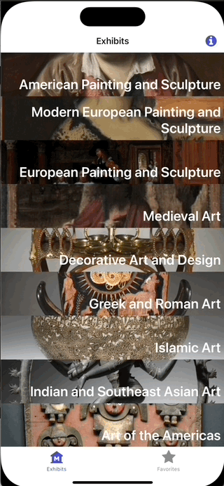

# Module 01: Hello, Router!

### Goal
Run the app and start exploring file-based routing by adding a few routes of your own.

### Concepts
- Running an Expo dev environment
- Adding routes in Expo Router
- Navigating to routes in Expo Router
- How layout files can customize the behavior of routes

### Tasks
- Get the app running on your local machine, displaying on your phone, simulator, or web browser
- Add the "visit" route and push to it from the main tabs
- Add a second tab, "Favorites" and customize the icon

# Exercises
## Exercise 1: Run the app

> If you've cloned and restored dependencies already, nice job! Skip straight to d).

### Start the local dev environment
1. Clone this repo so you can work on it locally. (Fork if you'd like to push your version back up to Github).
2. Run `npm install` to restore dependencies.
3. Run `npx expo start` to start the bundler.

At this point, you can run the app one of a few ways (you can use these at the same time)...

#### On your phone:
If you have Expo Go installed on your phone and both your phone and laptop are connected to the same wifi, scan the QR code on the terminal with your camera app.

#### On an emulator/simulator
Press `i` or `a` in the terminal window and the Expo CLI will install Expo Go on your iOS simulator or Android emulator (if available), and then run the app.

#### On the web
Press `w` and the app will open in your web browser. Currently this app gets kind of, uh, wide on your browser, so open Chrome DevTools to the right to shrink that down to mobile size.

## Exercise 2: Add the "Visitors info" screen

Let's add a screen- a simple static route that opens a screen with info about visiting the museum. There's already a button in the navbar. We just need to add the screen.

### What happens you navigate to a route that doesn't exist?
**Try out the button in the navbar.** What happens?

This could have been an error, but instead, Expo Router serves a fallback to an unmatched route from the **+not-found.tsx** file.

<!-- TODO: unmatched route syntax in template doesn't match docs, investigate: https://docs.expo.dev/router/error-handling/#unmatched-routes -->

### Add the missing route
The URL for the Visit screen will be `/visit`, so we need to add a file called **visit.tsx** to the root navigation folder (**/app**).

1. The new screen is premade for you in the **new-screens** folder. Copy **visit.tsx** to **app**.
2. **Try it**: Press the button in the navbar. Does the screen appear?

...no? Let's fix that.

### Fix the broken link
We'll learn more about layout files in a moment, but, since that button is in the navigation bar, it's defined in `**/app/(tabs)/_layout.tsx**.

If you go in there, you'll see a `Link` component defined for the right header of the first tab, but the `href` doesn't match the `/visit` route we're creating. In VS Code, you should see some red squiggles indicating that the URL doesn't match a route, thanks to [typed routes](https://docs.expo.dev/router/reference/typed-routes/).

Fix the route:

```diff _layout.tsx
headerRight: () => (
-  <Link href="/welcome" asChild>
+  <Link href="/visit" asChild>
    <Pressable>
```

 **Try it**: Try the button. It should open the modal now.

## Exercise 3: Add the "Favorites" tab.
It'll be pretty empty for now, but let's add a second tab that will eventually fill up with our "favorite" artwork, the stuff we want to see when we visit the museum.

Tabs aren't like your typical routes. Instead of pushing screens on top of each other with links (the default "stack" arrangement), they arrange themselves in a group where each tab can be accessed via a button in a bar. How does Expo Router know to arrange screens as tabs instead of a stack?

Two concepts make this happen:
- **route groups**: The parenthesis around `(tabs)` indicate that it's a route group. It's a way to indicate a relationship between routes without putting them in a folder that shows up as a segment of the URL.
- **layout files**: Each folder/group can have a **_layout.tsx** file. This is not its own route, but it is executed whenever the user navigates to a route inside the folder. It can define special rules about how to display the screens in the folder, code to execute prior to displaying the screen, etc.

In **app/(tabs)/_layout.tsx**, a tabs layout is defined and returned. This means that all the screens inside **(tabs)** will appear as tabs in the tab bar.

### Adding the tab
1. The new tab is premade for you in the **new-screens** folder. Copy **new-screens/(tabs)/two.tsx** to **app/(tabs)**.
2. **Try it out**: You should see a second tab and be able to navigate to it.

But... it's not named favorites, and the icon doesn't look right. Let's fix that.

### Sprucing up that tab
We can use the layout file to add information about how to display the new tab, including what icon to show.

Update **app/(tabs)/_layout.tsx** to define properties for the new tab:
```diff _layout.tsx
/>
+  <Tabs.Screen
+    name="two"
+    options={{
+      title: "Favorites",
+      tabBarIcon: ({ color }) => (
+        <TabBarIcon type="FontAwesome" name="star" color={color} />
+     ),
+    }}
+  />
</Tabs>
```

**Try it**: Your tab should be called "Favorites" and should have a star icon now.

## See the solution
Switch to branch: `01-hello-router-solution`