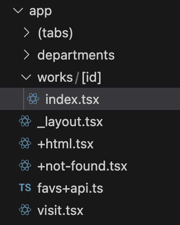

# Module 02: Dynamic Routes

### Goals
Add a dynamic route structure to enable navigating to a specific work of art.

### Concepts
- Dynamic route folder/filename syntax
- Navigating to a dynamic route
- App-specific deep links

### Tasks
- Add the `/works/[id]` dynamic route
- Use `Link` to make the works clickable from the `/departments/[department]` route.
- Try deep-linking directly to a department or artwork

# Exercises

## Exercise 1: Intro to dynamic routes
Dynamic routes let you put a variable into your URL, that you can then query on the destination screen. They are defined with square brackets, e.g., `[id]`.

There's already a dynamic route in the app: `/departments/[department]`. When you navigate to that route, the URL will contain the actual department, e.g., `/departments/Textiles`.

<!-- TODO: maybe make these URL's prettier with slugification, etc -->

**app/departments/[department]/index.tsx** reads the department like this:
```ts
const { department }: { department: string } = useLocalSearchParams();
```

Then it can use `department` in a query to get all works for that department.

**Try it**: It's easier to see the URL's in your web browser. Press `w` to open the app in your browser, and navigate to a department. Notice the URL. You can check out what `useWorksForDepartmentQuery` in the departments index screen is doing to see what happens to that `department` value in the URL.

**Try it (mobile edition)**: These same links work on your phone. Type the following into your phone web browser:

```
exp://[your computer's ip address]:8081/--/departments/Textiles
```

It should open up in your app (inside of Expo Go).

`exp` is the "scheme" that Expo Go registered with your mobile OS. iOS or Android knows to open your app when it sees that instead of `https://`. If you build a "standalone" version of this app, the scheme will match what is in **app.json**, and you will not need the IP address. The same deep link would be `artthing://departments/Textiles`.

## Exercise 2. Add the `/works/[id]` route
Let's add a dynamic route just like departments, except for individual works of art. The url will be `/works/[id]`. where ID is the unique identifier for the work of art. This will enable users to navigate to the details about a work of art from anywhere in the app.

1. Create a `works` folder under `app`, and an `[id]` folder under `works`. Your folder structure should look like this:



2. The new screen is premade for you in the **/new-screens** folder. Copy **new-screens/works/[id]/index.tsx** to **app/works/[id]/**.

**Try it**: This screen exists in your app; it's just not linked to anything yet. Try navigating to it in your web browser with the URL: `http://localhost:8081/works/92937`.

## Exercise 3: Link to the works screen

(Add gif here of navigating to departments)

Let's turn the items in that list of works by department to clickable things that will take us to `/works/[id]`:

Change **app/departments/[department]/index.tsx** to wrap each list item in a `Link`:
```diff
renderItem={({ item }) => (
+  <Link asChild href={`/works/${item.id}/`}>
+    <Pressable>
      <View className="flex-row bg-shade-1">
        <!-- etc.. -->
      </View>
+    </Pressable>
+  </Link>
)}
```

By default `Link` components make text linkable, but you can use `asChild` to make anything linkable.ß

## BONUS: Test out your new link in the app

Try another link in your phone web browser:

```
exp://[your computer's ip address]:8081/--/works/128056
```

## See the solution
Switch to branch: `02-dynamic-routes-solution`

## Next exercise
[Exercise 3](03-api-routes.md)