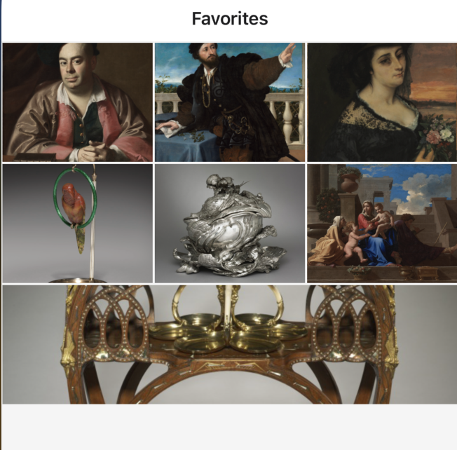

# Module 03: Dynamic Routes

### Goals
Add backend functionality to your app to "favorite" a work of art

### Concepts
- Creating API routes (not that different from express.js or any other RESTful API framework)
- Calling API routes (just fetch requests)

### Tasks
- Add the endpoint for reading and writing favorites status for a work of art
- Create the corresponding client-side fetch requests for reading and writing favorite status
- See the favoites come alive

### Notes
- The Expo Router template isn't configured for API routes out of the box, through this demo is already setup to use them. If you need to set these up on a new project, [check out the docs](https://docs.expo.dev/router/reference/api-routes/).

# Exercises

## Exercise 1. Add the `/works/[id]/fav` API route

API routes fit right into the Expo Router folder structure, matching their URL's using the same rules as client-side pages. So, route groups, dynamic routes, etc. apply to API routes.

An API route is defined by **+api** in the filename. API routes implement GET, POST, etc. functions. So, if you have a `GET` function in **app/works/[id]/fav+api.ts**, you can go to `http://localhost:8081/works/[id]/fav` in your browser and get a result.

### Add the GET request

Let's add **app/works/[id]/fav+api.ts** with that GET function:

```ts
import { ExpoRequest, ExpoResponse } from "expo-router/server";
import { Database } from '@/data/api/database';

export async function GET(request: ExpoRequest) {
  // read the query string
  const params = request.expoUrl.searchParams;
  const id = params.get("id")!;
  // read the favorites status from our database
  const database = new Database();
  const favStatus = await database.getFavoriteStatus(id);
  // make a json response
  return ExpoResponse.json(favStatus);
}
```
(don't sweat what the "database" is right now, the key lesson here is reading the request, doing something withit, and returning a response)

**Try it**: Go to `http://localhost:8081/works/92937/fav` in your browser. We can't write any favorites status yet, so you should get false. But... you should get something!

### Add the POST request

Now, add the POST function to the same file:
```ts
export async function POST(request: ExpoRequest) {
  // read the query string for ID
  const params = request.expoUrl.searchParams;
  const id = params.get("id")!;
  // read the body to get the payload
  const body = await request.json();
  const status = body.status;
  // write the updated status to our database
  const database = new Database();
  await database.setFavoriteStatus(id, status);
  // make a json response
  return ExpoResponse.json(status);
}
```

You could test this out right now with something like Postman, but we're about to write up GET and POST in the next exercise.

## Exercise 2. Call the API route (GET and POST) from your client code
The favorite button on a work of art (the heart) doesn't do anything yet, but there are placeholders already for reading and writing favorites status when a work is rendered.

To keep this clean, these queries are encapsulated in their own custom hooks in **/app/works/[id]/index.tsx**, which wrap Tanstack query calls:
```tsx
 // query art API for the work
  const workQuery = useWorkByIdQuery(id);
  const work = workQuery.data;

  // read fav status
  const favQuery = useFavStatusQuery(id);
  const isFav = favQuery.data;
```

Follow `useFavStatusQuery()` to its file inside **data/hooks**. These are standard RESTful API's that are called via the standard `fetch` API under the hood. Let's update **useFavStatusQuery.ts** to implement the actual GET request via fetch:

```diff
queryFn: async () => {
-  return false
+  const response = await fetch(`/works/${id}/fav`);
+  return await response.json();
},
```

<details>
  <summary>Expand to just get just the added code for easy copying</summary>

  ```tsx
const response = await fetch(`/works/${id}/fav`);
return await response.json();
  ```

</details>

Let's do the same with **useFavStatusMutation.ts**, implementing the POST:

```diff
mutationFn: async (favStatus: { id: string; status: boolean }) => {
  const { id, status } = favStatus;
-  return false;
+  const response = await fetch(`/works/${id}/fav`, {
+    method: "POST",
+    headers: {
+      Accept: "application.json",
+      "Content-Type": "application/json",
+    },
+    cache: "default",
+    body: JSON.stringify({ status }),
+  });
+  return await response.json();
},
```

<details>
  <summary>Expand to just get just the added code for easy copying</summary>

  ```tsx
  const response = await fetch(`/works/${id}/fav`, {
    method: "POST",
    headers: {
     Accept: "application.json",
     "Content-Type": "application/json",
   },
   cache: "default",
   body: JSON.stringify({ status }),
 });
 return await response.json();
  ```

</details>

**Try it:** Navigate to a work and try to favorite it. Try to unfavorite it. You should see that heart fill and unfill

## Exercise 3. Oh, look what happened to the Favorites tab!



Now that we're writing favorite status to the API, the Favorites tab, which already has its own API route to read all favorited artwork, should come alive. Try setting several works as a favorite and then navigate back to the Favorites tab to see them show up.

Go ahead and check out the API route calls in **app/(tabs)/two.tsx** to see how it all works.

## See the solution
Switch to branch: `03-api-routes-solution`

## Bonus exercise?
[Learn about deploying the app](bonus-deploy.md)